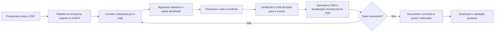
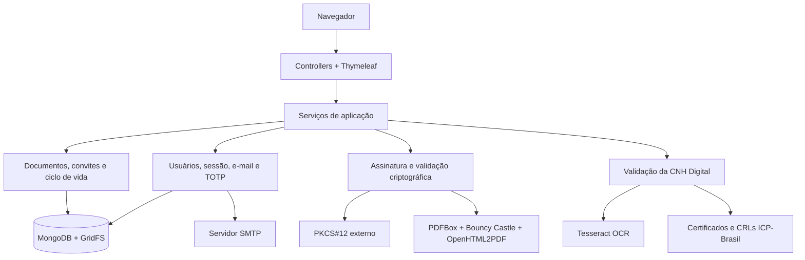
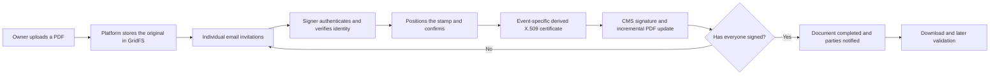
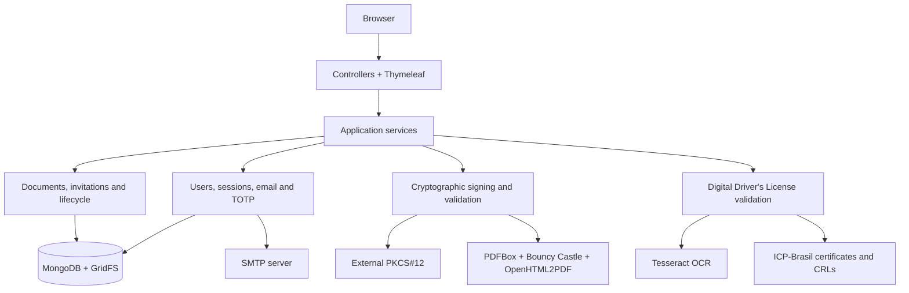

# Digital Signature Platform

Plataforma web para fluxos de assinatura eletrônica de documentos PDF com múltiplos signatários, verificação de identidade apoiada pela CNH Digital e validação criptográfica das assinaturas.

Web platform for electronic signature workflows involving PDF documents and multiple signers, identity verification supported by the Brazilian Digital Driver's License, and cryptographic signature validation.

[Português](#português) · [English](#english)

---

## Português

### Visão geral

A plataforma organiza a assinatura eletrônica como um ciclo de vida completo. Um usuário pode cadastrar um documento, convidar vários signatários, acompanhar pendências, aplicar assinaturas sucessivas sem invalidar as anteriores e validar posteriormente os blocos criptográficos presentes no arquivo.

O projeto combina:

- assinatura incremental de PDFs com **Apache PDFBox**;
- estruturas criptográficas **CMS/PKCS#7**, certificados X.509 e assinaturas RSA/SHA-256 com **Bouncy Castle**;
- cadastro, verificação de e-mail, recuperação de senha e autenticação de dois fatores TOTP;
- verificação criptográfica da CNH Digital contra a cadeia **ICP-Brasil**, com consulta não bloqueante a CRLs, análise de carimbo de tempo e extração de nome/CPF por OCR;
- gestão de documentos e versões no **MongoDB/GridFS**;
- convites individualizados por e-mail, tokens de acesso e acompanhamento do estado de cada assinatura;
- selo visual posicionável, renderizado com Thymeleaf e OpenHTML2PDF;
- validação posterior das assinaturas e registro de evidências técnicas de auditoria.

### Fluxo funcional



Cada convite é associado ao e-mail do signatário e a um token único. A aplicação mantém separadamente o PDF original e a versão corrente, aplica controle otimista de concorrência e remove versões intermediárias que deixaram de ser necessárias.

### Arquitetura

O sistema utiliza um monólito modular em camadas, com páginas renderizadas no servidor:



| Camada | Tecnologias e responsabilidades |
|---|---|
| Interface web | Thymeleaf, HTML e CSS; formulários, painel, visualização e posicionamento do selo |
| Aplicação | Spring Boot 3.0, controllers e serviços de domínio |
| Segurança de conta | BCrypt, verificação por e-mail, redefinição de senha e TOTP/Google Authenticator |
| Documentos | PDFBox, atualizações incrementais, versões original/corrente e selo visual |
| Criptografia | Bouncy Castle, CMS, X.509, PKIX e RSA/SHA-256 |
| Identidade | Validação da assinatura da CNH Digital, cadeia ICP-Brasil, CRL, TSA e Tess4J/Tesseract |
| Persistência | Spring Data MongoDB e GridFS |
| Infraestrutura | Maven, Docker Compose, MongoDB e SMTP |

### Pré-requisitos

Para executar o projeto, são necessários apenas o Docker Engine e o plugin Docker Compose v2.

### Configuração

Crie o arquivo de configuração e o diretório usado pelo Compose:

```bash
cp .env.example .env
mkdir -p secrets
```

O Compose monta `secrets/certificado.p12` no contêiner e usa `CERTIFICATE_PASSWORD`, definida no `.env`, para abrir o arquivo. Caso você ainda não possua um PKCS#12 para testes, gere um com OpenSSL:

```bash
openssl req -x509 -newkey rsa:4096 -sha256 -days 3650 -nodes \
  -keyout secrets/ca.key \
  -out secrets/ca.crt \
  -subj "/C=BR/O=Development/CN=Digital Signature Platform Development CA" \
  -addext "basicConstraints=critical,CA:TRUE" \
  -addext "keyUsage=critical,keyCertSign,cRLSign,digitalSignature"

openssl pkcs12 -export \
  -out secrets/certificado.p12 \
  -inkey secrets/ca.key \
  -in secrets/ca.crt \
  -name digital-signature-development-ca
```

Informe no `.env` a mesma senha usada na exportação do PKCS#12.

Principais variáveis:

| Variável | Finalidade |
|---|---|
| `CERTIFICATE_PASSWORD` | Senha do PKCS#12 |
| `CERTIFICATE_COMMON_NAME` | Nome da autoridade emissora |
| `CERTIFICATE_VALIDITY_TIME` | Validade do certificado derivado, em minutos |
| `CERTIFICATE_LOCATION` | Localidade incluída na configuração do certificado |
| `MONGODB_DATABASE` | Banco da aplicação |
| `MONGODB_USERNAME` / `MONGODB_PASSWORD` | Credenciais do MongoDB |
| `MAIL_HOST` / `MAIL_PORT` | Servidor SMTP |
| `MAIL_USERNAME` / `MAIL_PASSWORD` | Credenciais SMTP |
| `MAIL_FROM` | Remetente das mensagens |
| `APP_BASE_URL` | URL usada nos links enviados por e-mail |

### Execução com Docker

Depois de configurar `.env` e `secrets/certificado.p12`:

```bash
docker compose up --build
```

A aplicação estará em <http://localhost:8080> e o MongoDB em `localhost:27017`. Para encerrar:

```bash
docker compose down
```

Use `docker compose down -v` somente quando também desejar apagar os volumes locais do MongoDB e do repositório Maven.

### Testes

```bash
docker compose run --rm --build --no-deps app mvn test
```

Os testes atuais cobrem regras críticas do fluxo de convites, incluindo vínculo entre convite e e-mail autenticado, expiração, rejeição e conflitos otimistas durante assinaturas concorrentes.

### Estrutura do repositório

```text
src/main/java/.../projeto_assinador/
├── config/       # Segurança, interceptadores e configuração web
├── controller/   # Autenticação, documentos, assinatura, perfil e validação
├── dto/          # Objetos de entrada e saída
├── model/        # Usuários, documentos, convites, auditoria e estados
├── repository/   # Repositórios MongoDB
├── scheduler/    # Expiração e limpeza de documentos
├── service/      # Contratos e serviços criptográficos/identidade
└── validation/   # Validação de CPF

src/main/resources/
├── static/       # CSS e imagens
├── templates/    # Páginas e fragmentos Thymeleaf
└── ssl/          # Certificado público intermediário usado no acesso à ICP-Brasil
```

### Origem acadêmica e evolução do projeto

O repositório nasceu em um **projeto de extensão da Universidade Tecnológica Federal do Paraná (UTFPR)**. A base colaborativa foi desenvolvida por Eduardo Maciel, Fellipe Altran Fernandes e Carlos Eduardo Nishi. O encerramento dessa fase está preservado pela tag [`extension-project-completion`](../../tree/extension-project-completion), datada de 16 de dezembro de 2025.

Na etapa de extensão, a equipe estabeleceu a aplicação Spring Boot, as telas iniciais, cadastro e autenticação, integração com MongoDB, autenticação de dois fatores, assinatura e pré-visualização de PDFs, selo visual posicionável e validação inicial de documentos.

Após o encerramento formal da extensão, **Eduardo Maciel assumiu individualmente a evolução do software como artefato associado ao seu Trabalho de Conclusão de Curso**. Entre abril e junho de 2026, essa evolução transformou a demonstração inicial em uma plataforma voltada ao ciclo completo de assinatura:

- criação de documentos com vários signatários e convites individualizados;
- armazenamento do original e das versões assinadas no GridFS;
- controle de estados, cancelamento, rejeição, expiração e limpeza programada;
- controle otimista de concorrência para assinaturas simultâneas;
- verificação de identidade apoiada pela CNH Digital, com PKIX, CRL, TSA e OCR;
- emissão de um certificado X.509 derivado para cada evento de assinatura;
- assinatura incremental, preservação das assinaturas anteriores e download do original;
- reestruturação das telas, responsividade e gestão da conta;
- Docker Compose, cache dos certificados ICP-Brasil e testes de regras críticas;
- endurecimento do fluxo de convites, validação e tratamento de erros.

Essa separação histórica é importante: o protótipo inicial é resultado do trabalho dos três autores; a arquitetura de gestão documental e a análise acadêmica posteriores correspondem à evolução individual realizada por Eduardo Maciel para o TCC.

A versão atual corresponde ao escopo final definido e implementado para o TCC.

### Autores

| Autor | Participação | Contato |
|---|---|---|
| **Eduardo Maciel** | Base do projeto de extensão; backend, autenticação, 2FA e assinatura. Responsável pela evolução pós-extensão e pelo TCC. | [GitHub](https://github.com/DuMaciel) · `edumaciel1221@gmail.com` |
| **Fellipe Altran Fernandes** | Estrutura inicial, interface, fluxos de cadastro/login, assinatura visual e componentes de validação. | [GitHub](https://github.com/FellipeAltran) · `altranfellipe@gmail.com` |
| **Carlos Eduardo Nishi** | Evolução do serviço de assinatura, geração de certificados e ajustes de segurança criptográfica. | [GitHub](https://github.com/IshinSolarc) · `carlosnishi3528@gmail.com` |

### Limitações conhecidas

- A validação criptográfica da CNH confirma a integridade e a cadeia do documento, mas não prova biometricamente que quem o apresentou é seu titular.
- A consulta a CRLs opera em modo tolerante a falhas de rede; indisponibilidade externa pode impedir uma confirmação completa de revogação.
- O controle de acesso HTTP usa sessão e interceptadores próprios; a configuração atual do Spring Security permite todas as requisições e desabilita CSRF.
- Segredos TOTP são armazenados sem criptografia em repouso.

### Licença

Distribuído sob a licença MIT. Consulte [Licence](Licence).

---

## English

### Overview

The platform organizes electronic signing as a complete lifecycle. A user can register a document, invite multiple signers, track pending actions, apply successive signatures without invalidating previous ones, and later validate the cryptographic signature blocks embedded in the file.

The project combines:

- incremental PDF signing with **Apache PDFBox**;
- **CMS/PKCS#7**, X.509 certificates, and RSA/SHA-256 signatures with **Bouncy Castle**;
- account registration, email verification, password recovery, and TOTP two-factor authentication;
- cryptographic validation of the Brazilian Digital Driver's License against the **ICP-Brasil** certificate chain, including non-blocking CRL checks, timestamp analysis, and OCR extraction of the holder's name and CPF (Brazilian taxpayer identification number);
- document and version management with **MongoDB/GridFS**;
- email invitations, individual access tokens, and per-signer status tracking;
- a positionable visual signature stamp rendered with Thymeleaf and OpenHTML2PDF;
- subsequent signature validation and recording of technical audit evidence.

### Functional flow



Each invitation is bound to the signer's email address and a unique token. The application keeps the original and current PDF versions separately, uses optimistic concurrency control, and deletes intermediate files that are no longer required.

### Architecture

The application is a layered modular monolith with server-rendered pages:



| Layer | Technologies and responsibilities |
|---|---|
| Web interface | Thymeleaf, HTML, and CSS; forms, dashboard, viewing, and stamp positioning |
| Application | Spring Boot 3.0, controllers, and domain services |
| Account security | BCrypt, email verification, password reset, and TOTP/Google Authenticator |
| Documents | PDFBox, incremental updates, original/current versions, and visual stamp |
| Cryptography | Bouncy Castle, CMS, X.509, PKIX, and RSA/SHA-256 |
| Identity | Digital Driver's License signature validation, ICP-Brasil chain, CRLs, TSA, and Tess4J/Tesseract |
| Persistence | Spring Data MongoDB and GridFS |
| Infrastructure | Maven, Docker Compose, MongoDB, and SMTP |

### Requirements

Running the project requires only Docker Engine and the Docker Compose v2 plugin.

### Configuration

Create the configuration file and the directory used by Compose:

```bash
cp .env.example .env
mkdir -p secrets
```

Compose mounts `secrets/certificado.p12` into the container and uses `CERTIFICATE_PASSWORD`, defined in `.env`, to open the file. If you do not yet have a PKCS#12 file for testing, generate one with OpenSSL:

```bash
openssl req -x509 -newkey rsa:4096 -sha256 -days 3650 -nodes \
  -keyout secrets/ca.key \
  -out secrets/ca.crt \
  -subj "/C=BR/O=Development/CN=Digital Signature Platform Development CA" \
  -addext "basicConstraints=critical,CA:TRUE" \
  -addext "keyUsage=critical,keyCertSign,cRLSign,digitalSignature"

openssl pkcs12 -export \
  -out secrets/certificado.p12 \
  -inkey secrets/ca.key \
  -in secrets/ca.crt \
  -name digital-signature-development-ca
```

In `.env`, provide the same password used when exporting the PKCS#12 file.

| Variable | Purpose |
|---|---|
| `CERTIFICATE_PASSWORD` | PKCS#12 password |
| `CERTIFICATE_COMMON_NAME` | Issuing authority name |
| `CERTIFICATE_VALIDITY_TIME` | Derived-certificate validity in minutes |
| `CERTIFICATE_LOCATION` | Location included in the certificate configuration |
| `MONGODB_DATABASE` | Application database |
| `MONGODB_USERNAME` / `MONGODB_PASSWORD` | MongoDB credentials |
| `MAIL_HOST` / `MAIL_PORT` | SMTP server |
| `MAIL_USERNAME` / `MAIL_PASSWORD` | SMTP credentials |
| `MAIL_FROM` | Message sender |
| `APP_BASE_URL` | Base URL used in emailed links |

### Running with Docker

After configuring `.env` and `secrets/certificado.p12`:

```bash
docker compose up --build
```

The application will be available at <http://localhost:8080>, with MongoDB exposed at `localhost:27017`. Stop the stack with:

```bash
docker compose down
```

Use `docker compose down -v` only when you also intend to delete the local MongoDB and Maven volumes.

### Tests

```bash
docker compose run --rm --build --no-deps app mvn test
```

The current tests cover critical invitation rules, including the binding between an invitation and the authenticated email address, expiration, rejection, and optimistic conflicts during concurrent signing attempts.

### Repository structure

```text
src/main/java/.../projeto_assinador/
├── config/       # Security, interceptors, and web configuration
├── controller/   # Authentication, documents, signing, profile, and validation
├── dto/          # Input and output objects
├── model/        # Users, documents, invitations, audit records, and states
├── repository/   # MongoDB repositories
├── scheduler/    # Document expiration and cleanup
├── service/      # Interfaces and cryptographic/identity services
└── validation/   # Brazilian CPF validation

src/main/resources/
├── static/       # CSS and images
├── templates/    # Thymeleaf pages and fragments
└── ssl/          # Public intermediate certificate used to access ICP-Brasil
```

### Academic origin and project evolution

The repository originated in an **extension project at the Federal University of Technology – Paraná (UTFPR)**. Eduardo Maciel, Fellipe Altran Fernandes, and Carlos Eduardo Nishi jointly developed the collaborative baseline. The end of this phase is preserved by the [`extension-project-completion`](../../tree/extension-project-completion) tag, dated December 16, 2025.

During the extension project, the team established the Spring Boot application, initial interface, registration and authentication flows, MongoDB integration, two-factor authentication, PDF signing and preview, a positionable visual stamp, and initial document validation.

After the formal end of the extension project, **Eduardo Maciel independently continued developing the software as an artifact associated with his undergraduate thesis**. Between April and June 2026, this work transformed the initial demonstration into a platform focused on the complete signing lifecycle:

- multi-signer documents and individual invitations;
- storage of the original and signed versions in GridFS;
- state management, cancellation, rejection, expiration, and scheduled cleanup;
- optimistic concurrency control for simultaneous signing attempts;
- identity verification supported by the Digital Driver's License, PKIX, CRLs, TSA, and OCR;
- one derived X.509 certificate for each signing event;
- incremental signing, preservation of previous signatures, and original-file download;
- interface restructuring, responsive design, and account management;
- Docker Compose, ICP-Brasil certificate caching, and tests for critical rules;
- hardening of invitation flows, validation, and error handling.

This distinction matters: the initial prototype is the work of all three authors, while the document-management architecture and subsequent academic analysis are Eduardo Maciel's individual post-extension evolution for the thesis.

The current version represents the final scope defined and implemented for the thesis.

### Authors

| Author | Participation | Contact |
|---|---|---|
| **Eduardo Maciel** | Extension-project baseline; backend, authentication, 2FA, and signing. Responsible for post-extension development and the thesis. | [GitHub](https://github.com/DuMaciel) · `edumaciel1221@gmail.com` |
| **Fellipe Altran Fernandes** | Initial structure, user interface, registration/login flows, visual signing, and validation components. | [GitHub](https://github.com/FellipeAltran) · `altranfellipe@gmail.com` |
| **Carlos Eduardo Nishi** | Signature-service evolution, certificate generation, and cryptographic security adjustments. | [GitHub](https://github.com/IshinSolarc) · `carlosnishi3528@gmail.com` |

### Known limitations

- Cryptographic validation of a Digital Driver's License confirms its integrity and certificate chain, but does not biometrically prove that the presenter is the document holder.
- CRL checks tolerate network failures; external unavailability can prevent complete revocation confirmation.
- HTTP access control relies on custom sessions and interceptors; the current Spring Security configuration permits all requests and disables CSRF.
- TOTP secrets are stored without encryption at rest.

### License

Distributed under the MIT License. See [Licence](Licence).
